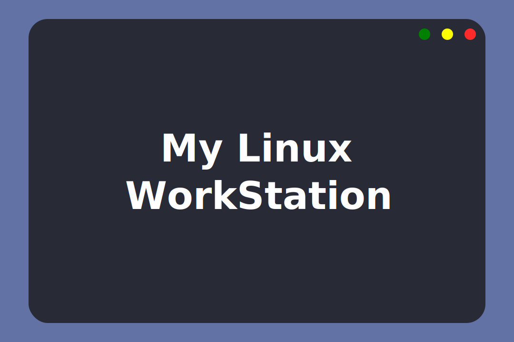

# Script de instalação &#128220;

## Motivação &#129300;

Formatações podem ser desgastantes, por isso criei este script e detalhei mais abaixo as configurações que faço.

> Esse script foi feito e testado no *Pop!_OS 20.04*.

## O que o script faz exatamente? &#129323;

### Programas &#128187;

A seguir está a lista de tudo que será instalado em ordem alfabética de acordo com o "tipo" de instalação.

* (APT) Audacity
* (APT) Blender
* (APT) cURL
* (APT) DarkTable
* (APT) dconf
* (APT) Discord
* (APT) Firefox
* (APT) Git
* (APT) Gnome Boxes
* (APT) Gnome Tweaks
* (APT) Google Chrome
* (APT) Insomnia Core
* (APT) Krita
* (APT) KVM
* (APT) LibreOffice
* (APT) Libs Gráficas
* (APT) Lutris
* (APT) Node.JS
* (APT) OBS Studio
* (APT) Opera
* (APT) PostgreSQL
* (APT) Python 3
* (APT) Ruby
* (APT) Sqlite
* (APT) Steam
* (APT) Typora
* (APT) Unrar
* (APT) Vim
* (APT) Visual Studio Code
* (APT) Vivaldi
* (APT) VLC
* (APT) ZSH
* (APT) Suporte a Flatpak (EXTRA: caso a distro não tenha)
* (APT) Suporte a Snaps (EXTRA: caso a distro não tenha)
* (SNAP) Sosumi
* (FLATPAK) Suporte ao FlatHub (caso a distro não tenha)
* (FLATPAK) Foliate
* (FLATPAK) GIMP
* (FALTPAK) InkScape
* (FALTPAK) Kdenlive
* (FLATPAK) LibreSprite
* (FLATPAK) Pixelorama
* (FLATPAK) RawTherapee
* (FLATPAK) Spotify
* (FLATPAK) Telegram
* (OTHER) Android Studio
* (OTHER) Expo
* (OTHER) Free Download Manager
* (OTHER) Itch
* (OTHER) JDK 8
* (OTHER) Postbird
* (OTHER) RClone
* (OTHER) React
* (OTHER) Yarn

### Configurações &#9881;

Além de adicionar todos os repositórios oficiais necessários, o script também configura as variáveis de ambiente do JDK 8 e do Android Studio.

Além disso ele habilita os emojis do Yarn, faz as principais configurações do Git e instala o tema Dracula no Typora.

> Ainda é necessário abrir o Typora e habilitar o tema.

## Executando o script &#128163;

### Atenção &#9760;

Esteja ciente de que esse script está com minhas configurações pessoais e pode ser que o script quebre caso algum app tenha que não é existe nos gerenciadores de pacotes tenha atualizado.

É interesssante você dar uma olhada no script antes de executá-lo. Há alguns pontos importantes em que você precisa estar atento:

* Acesse o arquivo `./scripts/settings/android-studio.sh` e em `CURRENT_USER` altere para o nome do seu usuário.
* É de vital impotância que os SDKs do Android Studio sejam baixados no diretório `~/Android/Sdk` já criado durante a instalação. Caso você deseje alterar esse diretório acesse o arquivo `./scripts/settings/android-studio.sh`.
* O script não baixa a versão mais recente do JDK8, mas sim a versão 1.8.0-261. Caso queira a versão mais recente recomendo fazer manualmente a configuração. Recomendo esse tutorial [aqui](https://www.javahelps.com/2015/03/install-oracle-jdk-in-ubuntu.html).
* Como o script não baixa a versão mais recente do JDK 8, é necessário alterar as versões no script conforme a versão nesse servidor extraoficial é atualizada. Caso o script dê erro por não encontrar o JDK 8 no servidor, abra o arquivo *./others/jdk8.sh*, procure pelo número da versão e compare com o que está hospedado no [servidor](http://enos.itcollege.ee/~jpoial/allalaadimised/jdk8). Caso não sejam as mesmas versões basta substituir o número da versão mais nova no script, ele funcionará normalmente.
* Acesse o arquivo `./scripts/settings/git.sh` e altere as configurações de conta do git para as suas configurações pessoais.
* O tema Dracula para o Typora só é instalado caso você já tenha aberto o app pela promeira vez para ele criar as pastas de configurações. Tente abri-lo assim que instalado para tudo correr bem.

### Mão na massa &#129302;

1. Baixe o arquivo *.zip* ou clone esse repositório.
2. Abra o terminal na pasta em que você extraiu ou clonou esse repositório (não dentro da pasta resultante *script-linux*).
3. Execute o comando `sudo chmod -R a+x ./script-linux/` para dar as permissões para a execução do script.
4. Entre na pasta *script-linux* pelo terminal e dê o comando `./install.sh`.

## Minhas configurações manuais e downloads extras &#128406;

### Davinci Resolve &#127916;

Por ser necessário login é necessário baixar manualmente. Acesse [Davinci Resolve](https://www.blackmagicdesign.com/br/products/davinciresolve).

### Itch &#128377;

É necessário deletar manualmente seu instalador.

### Terminal &#129499;

Como isso envolve uma troca de Shells e reinicialização do computador, não há como fazer via script, mas segue a sequência de comandos para a configuração do terminal.

> Obs.: O ZSH já foi instalado, agora precisamos trocar o Bash por ele.

#### ZSH

1. Digite no terminal: `chsh -s $(which zsh)`.
2. Reinicie o computador.
3. Abra o terminal e digite `2`.

#### Oh My ZSH

4. Execute `sh -c "$(curl -fsSL https://raw.githubusercontent.com/robbyrussell/oh-my-zsh/master/tools/install.sh)"`.

#### Tema Dracula no Gnome Terminal

5. Execute `git clone https://github.com/dracula/gnome-terminal`.
6. Execute `cd gnome-terminal`.
7. Execute `./install.sh`.

#### Fira Code

8. Acesse e baixe a versão mais recente do **Fira Code**: `https://github.com/ryanoasis/nerd-fonts/releases/`.
9. Extraia o .zip.
10. Recorte a pasta.
11. Cole a pasta no diretório **~/.fonts**.
12. Acesse as configurações do terminal e defina `FiraCode Nerd Font Retina` como sua fonte.

#### Tema Spaceship

13. Execute: `git clone https://github.com/denysdovhan/spaceship-prompt.git "$ZSH_CUSTOM/themes/spaceship-prompt"`.
14. Execute `ln -s "$ZSH_CUSTOM/themes/spaceship-prompt/spaceship.zsh-theme" "$ZSH_CUSTOM/themes/spaceship.zsh-theme"`.
15. Execute `gedit ~/.zshrc`.
16. Mude o conteúdo do ZSH_THEME para `spaceship`.
17. Feche o terminal e abra-o novamente.
18. No fim do arquivo adicione:

```bash
SPACESHIP_PROMPT_ORDER=(
  user          # Username section
  dir           # Current directory section
  host          # Hostname section
  git           # Git section (git_branch + git_status)
  hg            # Mercurial section (hg_branch  + hg_status)
  exec_time     # Execution time
  line_sep      # Line break
  vi_mode       # Vi-mode indicator
  jobs          # Background jobs indicator
  exit_code     # Exit code section
  char          # Prompt character
)
SPACESHIP_USER_SHOW=always
SPACESHIP_PROMPT_ADD_NEWLINE=false
SPACESHIP_CHAR_SYMBOL="❯"
SPACESHIP_CHAR_SUFFIX=" "
```

19. Feche o terminal e abra-o novamente.

#### Plugins

20. Execute `sh -c "$(curl -fsSL https://raw.githubusercontent.com/zdharma/zinit/master/doc/install.sh)"`.
21. Execute `gedit ~/.zshrc`.
22. No fim do arquivo adicione:

```bash
zinit light zdharma/fast-syntax-highlighting
zinit light zsh-users/zsh-autosuggestions
zinit light zsh-users/zsh-completions
zinit light zsh-users/zsh-history-substring-search
zinit light buonomo/yarn-completion
```

#### Comando `ls` colorido

23. Execute `sudo gem install colorls`.
24. Abra o arquivo *.zshrc* e adicione a linha `source $(dirname $(gem which colorls))/tab_complete.sh` no final do arquivo.
25. Abra o gerenciador de arquivos entre no diretório *~/.config* e crie uma pasta chamada **colorls**.
26. Execute `cp $(dirname $(gem which colorls))/yaml/dark_colors.yaml ~/.config/colorls/dark_colors.yaml`.
27. Abra o arquivo *~/.config/colorls/dark_colors.yaml* e adicione/substitua as seguintes linhas:

```shell
# Main Colors
unrecognized_file: palegreen
recognized_file:   turquoise
dir:               dodgerblue
```

28. Agora abra o arquivo *~/zshrc* e adicione as seguintes linhas no final do arquivo:

```shell
alias ls='colorls -h --group-directories-first -1'
alias l='colorls --group-directories-first --almost-all'
alias ll='colorls --group-directories-first --almost-all --long'
```

### Insomnia Core &#128299;

1. Abra o Insomnia Core.
2. Clique no menu *Aplication* e escolha *Preferences*.
3. Na janela que se abre, na aba *General*, mude o *Editor Indent Size* para 4.
4. Clique na aba *Plugins*.
5. Digite `insomnia-plugin-dracula-theme` no campo e clique em *Install plugin*.
6. Agora, na aba *Themes*, clique em *Dracula*.

### Visual Studio Code &#127913;

Recomendo a extensão Settings Sync para salvar as configurações.

1. Instalar a extensão *Settings Sync*.
2. Autorizar ela a usar o GitHub.
3. Baixar as configurações (SHIFT + ALT + D).

### Telegram &#128172;

1. Abra o menu e clique em *Settings*.
2. Escolha *Chat Settings* e, em *Chat background*, clique em *Choose from file*.
3. Na janela que se abre procure pelo arquivo *colors.tdesktop-theme* na pasta *telegram* que foi baixada dentro da pasta do script (*script-linux*).
4. Escolha uma imagem de fundo para combinar com o tema.
5. Caso queira, pode deletar a pasta do tema.

### Typora &#128196;

1. Clicar no menu *Temas* e escolher *Dracula*.

### Sosumi &#129405;

1. Digitar `sosumi` e esperar que o download se conclua.

### Spotify &#127911;

1. Colocar as playlists para baixar.

### Configurações do Gnome &#128736;

1. Na aba *Aparência* importe e defina o papel de parede.
2. Na aba *Privacidade* selecione *Histórico de arquivos e lixeira* e desmarque a opção **Histórico de arquivos**.
3. Na aba *Energia* altere o tempo para que a tela se apague para **15min**.
4. Na aba *Telas* selecione **Luz noturna** e habilite-a.
5. Na aba *Mouse e Touchpad* desligue a **Rolagem Natural**.
6. Na aba *Usuários* altere a **foto de perfil**.

### Gnome Tweaks &#128295;

1. Abrir Gnome Tweaks.
2. Na aba *Aparência* altere e instale temas como quiser.
3. Na aba *Barra superior* habilite **Porcentagem da bateria**, **Dia da semana**, **Números das semanas**.
4. Na aba *Janelas* habilite **Centralizar novas janelas**.
5. Na aba *Teclado e mouse* defina o *Perfil de aceleração* do mouse como **Flat**.

### Free Download Manager &#128722;

1. Clicar no menu hamburguer e escolher *Preferências*.
2. Mude então para o tema escuro.

### Android Studio &#9879;

1. Rode o Android Studio com o comando *studio.sh* no terminal.
2. Selecione *Custom* na instalação das dependências, avance.
3. Coloque a pasta correta do JDK, avance.
4. Selecione o emulador, avance.
5. Abra as intruções sobre o KVM, finalize.
6. Após finalizarem as instalações obrigatórias clique em *Configure* e, em seguida, *Create Desktop Entry* para o Android Studio aparecer no menu da distro.
7. Baixe o SDK 28 (usado no React atualmente) e o que mais for necessário.

### RClone

1. Acesse [https://rclone.org/docs/](https://rclone.org/docs/) para configurá-lo.

### PostgreSQL

1. Execute `ps -ef | grep postgres`
2. Execute `sudo su - postgres`
3. Execute `createuser -EPd lucasmc64` (lucasmc64 é o nome de usuário que escolhi) e dê a senha que desejar
4. Feche o terminal e abra novamente
5. Execute `psql -U lucasmc64 -h127.0.0.1 postgres`
