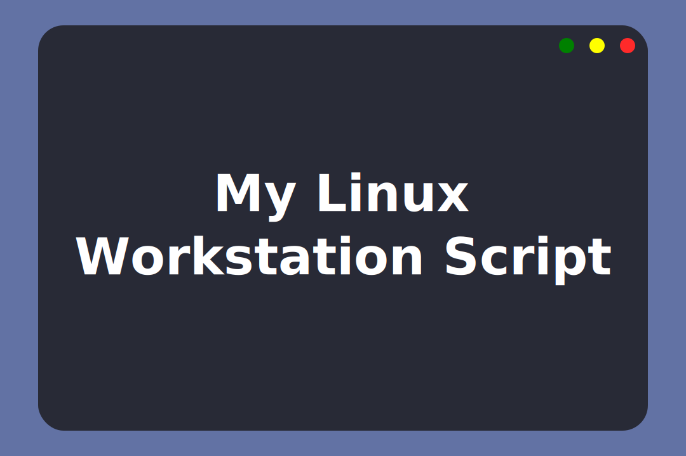

# :scroll: My Linux WorkStation Script

> This script was made and tested on *Pop! _OS 20.04* and there is no guarantee that it will work on other distros or versions of this one.

## :thinking: What exactly does the script do?

### :technologist: Programs

Its main objective is to automate the installation of the programs I use on a daily basis, either via APT, Flatpak, Snap or by downloading the necessary files in other ways.

> Access the script to find out which packages are installed.

### :gear: Configs

In addition to adding as few PPAs as possible (so that the OS doesn't break after updates), the script also sets the JDK 8 and Android Studio environment variables.

In addition, it enables Yarn emojis, makes the main settings for Git, installs the Dracula theme on Typora and some other little things.

## :bomb: Running the script

### :skull_and_crossbones: Atention

Be aware that this script has my personal settings and it may break if any packages do not exist in the standard repositories or have been updated.

It is interesting that you take a look at the script before running it. There are a few important points you need to be aware of:

* It is vitally important that the Android Studio SDKs are downloaded from the `~/Android/Sdk` directory already created during installation. If you want to change this directory, change the script.
* The script does not download the latest version of JDK8. If you want the latest version, I recommend manually setting it up. I recommend this tutorial [here](https://www.javahelps.com/2015/03/install-oracle-jdk-in-ubuntu.html).
* Change your Git account settings to your personal settings.

### :robot: It's time

1. Download the *.zip* file or clone this repository.
2. Open the terminal in the folder you extracted from the compressed file or the clone of that repository.
3. Run the command `sudo chmod +x ./install.sh` to give the permissions to execute the script.
4. Now run the `./install.sh` file.

> Note: Near the end of the script execution, Typora will open. This is necessary to proceed with installing the theme on it.

## :tada: If everything went well...

Now you are running all beautifully!

## :memo: License

This project is under the MIT license. See the [LICENSE](LICENSE) for more information.

---

Made with :white_heart: by Lucas Coutinho :wave: [Get in touch!](https://www.linkedin.com/in/lucasmc64/)